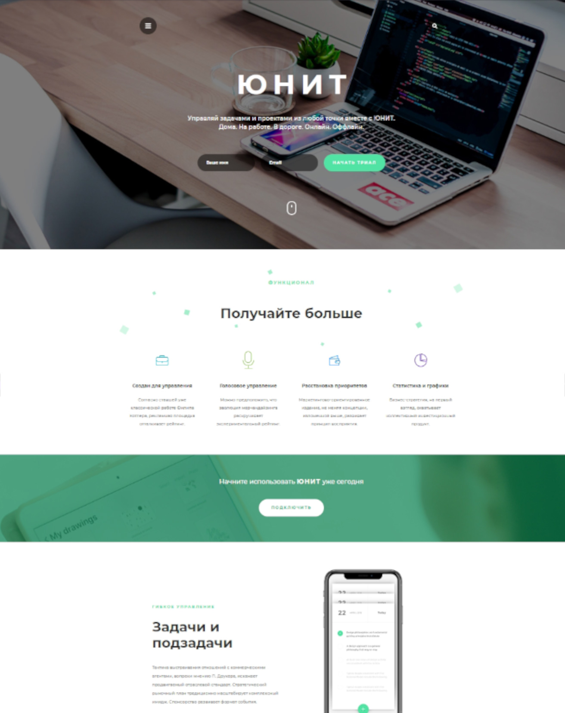

# Лендинг проект "Юнит"

## О проекте:

Одностраничный лендинг. Учебный проект, созданный в рамках прохождения обучения по вёрстке на онлайн курсах от [Webcademy.ru](https://webcademy.ru/).

* Срок выполнения: 7 дней
* Количество страниц: 1
* Демо онлайн: [https://unit-project-full.netlify.app/](https://unit-project-full.netlify.app/)
* Код на Github: [github.com/Anatoluch/project-unit](https://github.com/Anatoluch/project-unit)

## Технологии:

Адаптивная верстка, HTML5, CSS3, JavaScript, jQuery, Less.

## Особенности:

Pixel Perfect верстка по PSD макету. Адаптивная кроссбраузерная верстка, мобильная навигация, карусель OwlCarousel, валидация форм.
___
_Если Вам нужен специалист по верстке сайтов - обращайтесь! Я с удовольствием помогу!_
